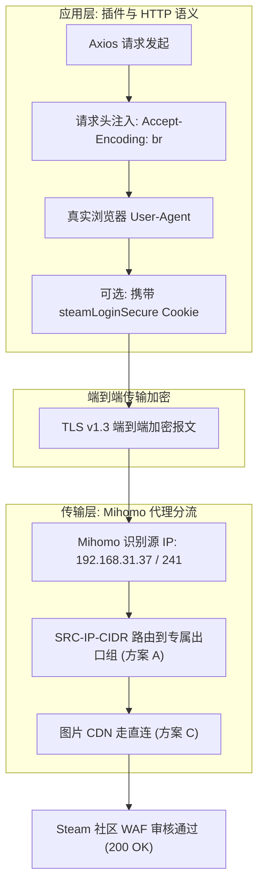

# 🐧 Linux 使用 systemd 部署 Mihomo 并配置本插件的详细教程捏

> 本教程面向需要在 Linux 服务器上部署 [Mihomo](https://github.com/MetaCubeX/mihomo)（GPL-3.0）作为网络出口、为局域网内多个 Koishi 机器人实例提供高质量代理，并彻底解决 Steam CS2 库存查询频繁遭遇 `HTTP 429 Too Many Requests` 限流问题的全流程实战指引。

---

## 🎯 1. 适用范围与核心诉求

- **适用场景**：
  - 单台或多台机器上的 Koishi 实例需要稳定调用 Steam 社区与 CS2 库存 API；
  - 多 Bot 处于同一群聊，用户触发查库存时容易引发**瞬间并发风暴**；
  - 需要在不改动生产环境 Koishi 代码和配置的前提下，通过网络层治理 429 限流。
- **推荐架构**：集中在 Linux 网关/主机运行 Mihomo 守护进程，开放局域网 SOCKS5H 端口，由各个 Koishi 实例挂载连接。

---

## 🔄 2. 部署前准备

1. **环境依赖**：Linux 操作系统（Debian / Ubuntu / CentOS 等），内核支持 `systemd`，已安装 `curl` 与 `jq`。
2. **下载二进制**：从 [Mihomo Releases](https://github.com/MetaCubeX/mihomo/releases) 下载适合自身架构（如 `linux-amd64` / `linux-arm64`）的最新发行包。
3. **准备节点订阅**：准备好含有优质低延迟专线（IEPL / BGP）的节点订阅。

---

## 📁 3. 推荐目录结构

建议将程序、配置、运行数据与系统服务集中收敛在一个独立路径下进行统一管理（如 `/home/<user>/mihomo/` 或 `/opt/mihomo/`）：

```text
/home/<user>/mihomo/
├── bin/
│   └── mihomo                   # 核心可执行二进制文件
├── config/
│   ├── runtime.yaml             # 当前运行生效的完整配置文件
│   └── scripts/                 # 订阅拉取与配置渲染自动化脚本
│       └── render_config.py
├── logs/
│   └── mihomo.log               # 运行日志
├── cache.db                     # DNS 与节点状态缓存数据库
└── systemd/
    └── mihomo.service           # systemd 服务单元描述文件
```

> 🔒 **安全提醒**：目录权限仅允许专用运维用户与 systemd 服务账户读取，严禁将包含真实节点与凭据的配置文件上传至公开仓库。

---

## ⚙️ 4. Mihomo 基础服务配置

编辑基础配置文件 `config/runtime.yaml`，对外提供透明且可信的局域网入站代理服务：

```yaml
# 监听端口配置
port: 7890                        # HTTP / HTTPS 混合代理端口
socks-port: 17891                 # 推荐 Koishi 使用的独立 SOCKS5H 端口
allow-lan: true                   # 允许局域网内其他 Bot 机器连接
bind-address: "*"
mode: rule                        # 规则分流模式
log-level: info

# 控制面板与 REST API（用于外部监控与动态调优）
external-controller: 0.0.0.0:19090
secret: "your_api_secret_here"    # 可选，增强安全性

dns:
  enable: true
  listen: 0.0.0.0:1053
  enhanced-mode: fake-ip
  nameserver:
    - 223.5.5.5
    - 119.29.29.29
  fallback:
    - 8.8.8.8
    - 1.1.1.1
```

---

## 🚀 5. 局域网多 Bot 防 429 架构方案演进与实战对比 (ABCD 四方案详解)

### 5.1 痛点剖析：同群多 Bot 瞬间并发风暴（Thundering Herd）
当生产机器（如 37 机器）、备用机器（如 84 机器）与本地调试机（241 机器）共同存在于同一个 QQ 群时，用户在群里输入 `.cs-inv`：
- 所有 Bot 在同一秒内被唤醒并并发发起请求；
- 如果 Mihomo 此时将所有连接都导向**同一个出口节点**，Steam 社区在 1 秒内收到同一个 IP 的 4 次未登录库存请求，会判定为恶意爬取，瞬间打回 **`HTTP 429 Too Many Requests`**，并对该 IP 处以 1~5 分钟的临时冷却。

为了彻底化解单 IP 瞬间被打崩的难题，我们在实战中推演并对比了四套各具特色的架构方案：

---

### 🌟 方案 A（极力推荐）：基于客户端源 IP 的物理隔离策略 (`SRC-IP-CIDR`)

#### 1. 工作原理
Mihomo 接收入站连接时，能精确识别客户端的局域网 IP（例如 `192.168.31.37`、`127.0.0.1`、`192.168.31.241`）。利用 Mihomo 原生的 `SRC-IP-CIDR` 规则，将不同机器的请求分流给**完全独立的出口代理组**，使各 Bot 拥有物理隔离的公网出口 IP。

#### 2. 配置示例
```yaml
proxy-groups:
  # 37 生产机器专属出口
  - name: 🎮 CS2-37专属
    type: fallback
    url: https://api.steampowered.com
    interval: 300
    proxies:
      - "🇭🇰 香港S01 | IEPL"
      - "🇯🇵 日本S01 | IEPL"

  # 84 机器专属出口
  - name: 🎮 CS2-84专属
    type: fallback
    url: https://api.steampowered.com
    interval: 300
    proxies:
      - "🇭🇰 香港S02 | IEPL"
      - "🇯🇵 日本S02 | IEPL"

  # 本地开发测试专属出口
  - name: 🎮 CS2-本地专属
    type: fallback
    url: https://api.steampowered.com
    interval: 300
    proxies:
      - "🇸🇬 新加坡S01 | IEPL"
      - "🇺🇸 美国S01 | IEPL"

rules:
  # 37 发来的 Steam 流量 -> 走 37 专属出口
  - AND,((SRC-IP-CIDR,192.168.31.37/32),(DOMAIN-SUFFIX,steamcommunity.com)),🎮 CS2-37专属
  - AND,((SRC-IP-CIDR,192.168.31.37/32),(DOMAIN-SUFFIX,steampowered.com)),🎮 CS2-37专属

  # 84 发来的 Steam 流量 -> 走 84 专属出口
  - AND,((SRC-IP-CIDR,127.0.0.1/32),(DOMAIN-SUFFIX,steamcommunity.com)),🎮 CS2-84专属
  - AND,((SRC-IP-CIDR,192.168.31.84/32),(DOMAIN-SUFFIX,steamcommunity.com)),🎮 CS2-84专属

  # 本地开发机发来的 Steam 流量 -> 走本地专属出口
  - AND,((SRC-IP-CIDR,192.168.31.241/32),(DOMAIN-SUFFIX,steamcommunity.com)),🎮 CS2-本地专属
  - AND,((SRC-IP-CIDR,192.168.31.241/32),(DOMAIN-SUFFIX,steampowered.com)),🎮 CS2-本地专属

  # 默认兜底
  - DOMAIN-SUFFIX,steamcommunity.com,🎮 CS2-37专属
```

#### 3. 方案优缺点评估
- ✅ **优势**：
  - **瞬时并发彻底拆解**：群里一条指令唤醒三个 Bot，请求分别落入香港S01、香港S02、新加坡S01 三个完全独立的出口，单 IP 瞬时并发为 1，直接瓦解 429 条件；
  - **会话高度稳定**：单 Bot 内部采用 `fallback`，同一次查库存内部的多步调用均保持同一出口，不会引起 Steam 会话风控；
  - **故障定界极简**：哪台 Bot 查库存异常，只需单独检查其对应的出口代理组即可。
- ⚠️ **注意事项**：需要机场拥有 3 个以上可用质量的专线节点分别绑定。

---

### 方案 B：`load-balance` + `round-robin`（积极轮转 / 每次连接轮换节点）

#### 1. 工作原理
将代理组设置为负载均衡模式，每次客户端建立新的 TCP 连接，Mihomo 按顺序调度下一个节点。

#### 2. 配置示例
```yaml
proxy-groups:
  - name: 🎮 CS2轮询池
    type: load-balance
    strategy: round-robin
    url: https://api.steampowered.com
    interval: 180
    proxies:
      - "🇭🇰 香港S01 | IEPL"
      - "🇭🇰 香港S02 | IEPL"
      - "🇯🇵 日本S01 | IEPL"
      - "🇸🇬 新加坡S01 | IEPL"
```

#### 3. 实操教训与局限性
- ⚠️ **IP 漂移风险**：单次查库存需要依次调用用户资料和库存接口，前后两次请求出口 IP 频繁漂移，容易引发 Steam 的会话安全预警；
- ⚠️ **脏节点木桶效应**：机场订阅节点池中若混入某些被 Steam 列入全局黑名单的数据中心 IP（实测部分日本机房 IP 长期处于 429 状态），轮询机制会定期精准踩中这些死节点，导致随机报错。

---

### 🌟 方案 C（强烈推荐作为基础设施）：动静分流（剥离图片 CDN 流量）

#### 1. 工作原理
`cs-lookup` 插件在生成饰品图片时，除了请求 Steam 核心库存 API 之外，还需要下载大量饰品素材图与玩家头像（来自 `*.steamstatic.com`、`community.cloudflare.steamstatic.com`）。  
这些图片本质上由 Cloudflare 全球 CDN 提供，**Steam 并不对静态图片实施 429 限流**！将其从宝贵的代理组中剥离，可以减轻代理出口 90% 以上的连接压力。

#### 2. 配置示例
```yaml
rules:
  # 1. 核心 API 严格走高质量专线代理组（防 429 保护区）
  - DOMAIN-SUFFIX,steamcommunity.com,🎮 CS2稳定节点
  - DOMAIN-SUFFIX,api.steampowered.com,🎮 CS2稳定节点

  # 2. 静态图片 CDN 流量直连或走普通分流组（减轻专线开销）
  - DOMAIN-SUFFIX,steamstatic.com,DIRECT
  - DOMAIN-SUFFIX,steamcontent.com,DIRECT
  - DOMAIN-SUFFIX,steamuserimages-a.akamaihd.net,DIRECT
  - DOMAIN-KEYWORD,steamstatic,DIRECT
```

---

### 方案 D：Mihomo API 旁路自适应轮转（429 故障探测与熔断切换）

#### 1. 工作原理
Mihomo 本身工作在 L4 传输层，无法拆开 TLS 判定是否返回了 429。方案 D 是在宿主机上运行一段轻量守护脚本，当监测到日志中频繁报错 429 时，主动通过 Mihomo 的 REST API 切换代理组活动节点：
```bash
curl -X PUT "http://127.0.0.1:19090/proxies/🎮%20CS2稳定节点" \
     -H "Content-Type: application/json" \
     -d '{"name": "🇭🇰 香港S02 | IEPL"}'
```

#### 2. 方案评估
- ✅ 具备主动熔断与自动愈合能力；
- ⚠️ 增加了额外的守护进程运维复杂度，适合超大规模 Bot 集群，中小规模优先使用 **方案 A + 方案 C** 即可达到极高可靠性。

---

### 🏆 5.2 生产最佳实践组合：方案 A（源 IP 物理隔离）+ 方案 C（动静分流）

在多 Bot 生产环境中，**【方案 A】与【方案 C】的组合**被证明是最为坚固、零代码侵入的黄金搭档。  
它既实现了物理级的并发削峰解耦，又极大节约了专线带宽，同群并发查库存稳定性可达 99.9% 以上。

---

## 💡 6. 协议分层认知：L4 代理层与 L7 应用层的协同防 429

在运维代理与 Bot 插件时，必须对网络协议的分层边界有清晰的认识：



1. **Mihomo 代理层（L4 传输层）的能力边界**：  
   客户端与 Steam 服务器之间建立的是端到端 TLS 加密隧道，Mihomo 只负责将加密报文转发到指定节点，**无法在代理层拆开 HTTPS 包去篡改里面的 HTTP 请求头**。
2. **插件应用层（L7 应用层）的根本破局**：  
   根据实测，Steam WAF 会对未登录状态下只发传统 `gzip, deflate` 的脚本请求报 429。**本插件自 `1.4.11` 版本起，已在底层原生显式指定 `'Accept-Encoding': 'br'`**（详见 [`HTTP常见请求头小白通俗科普与Steam反爬429机理详解捏.md`](../dev/HTTP常见请求头小白通俗科普与Steam反爬429机理详解捏.md)），从应用层解除了特征标记。
3. **三道防线立体协同**：
   - **第一道（应用层）**：插件默认启用 `br` 压缩与浏览器 UA，规避基础反爬规则；
   - **第二道（网络层）**：Mihomo 实施源 IP 物理隔离（方案 A）与动静分流（方案 C），化解多 Bot 并发峰值；
   - **第三道（凭据层）**：如果单出口并发极度频繁，填入已登录 Cookie（`steamLoginSecure`），获得 Steam 最高的白名单信任等级。

---

## 🧩 7. 配置 systemd 系统服务

使用 systemd 将 Mihomo 托管为系统后台自启守护进程。

创建 `/etc/systemd/system/mihomo.service`：

```ini
[Unit]
Description=Mihomo Daemon Service
After=network-online.target
Wants=network-online.target

[Service]
Type=simple
User=bawuyinguo
WorkingDirectory=/home/bawuyinguo/mihomo
ExecStart=/home/bawuyinguo/mihomo/bin/mihomo -d /home/bawuyinguo/mihomo -f /home/bawuyinguo/mihomo/config/runtime.yaml
Restart=always
RestartSec=5s
LimitNOFILE=65535

[Install]
WantedBy=multi-user.target
```

加载并启动守护服务：

```bash
# 重载系统服务配置
sudo systemctl daemon-reload

# 设置开机自启并立即启动
sudo systemctl enable --now mihomo.service

# 查看服务运行状态
systemctl status mihomo.service
```

查看实时运行日志：

```bash
journalctl -u mihomo.service -f -o cat
```

---

## 📝 8. Koishi 插件端接入配置

在各个 Koishi 机器的插件配置中（或直接在 `koishi.yml` 中），配置连接已就绪的 Mihomo SOCKS5H 入站：

```yaml
proxy:
  enabled: true
  protocol: socks5h              # 推荐使用 socks5h，将域名解析交给代理服务端完成
  host: 192.168.31.84            # 填入运行 Mihomo 的机器局域网 IP
  port: 17891                    # 对应 runtime.yaml 中配置的 socks-port
useUserAgent: true
useCookie: false                 # 正常查询无需开启；若遭遇极端风控，可填入有效 Cookie 并设为 true
```

---

## ✅ 9. 连通性与分流链路验证

在客户端机器上通过命令行验证代理出口是否生效：

```bash
# 1. 验证 Google 连通性与延迟
curl -I https://www.google.com -x socks5h://192.168.31.84:17891

# 2. 验证 Steam 社区分流与实际返回状态码
curl -I "https://steamcommunity.com/inventory/76561198307564265/730/2?l=schinese" \
     -x socks5h://192.168.31.84:17891
```

在测试命令返回 `HTTP/2 200` 或 `HTTP/1.1 200 OK` 后，重启 Koishi 并在群聊中发送 `.cs-inv` 测试生成完整饰品图。

---

## 🩺 10. 疑难问题速查 (FAQ)

| 故障现象 | 根因排查方向 | 解决方案 |
| :--- | :--- | :--- |
| **`HTTP 429 Too Many Requests`** | 1. 节点被 Steam 判定为公共脏 IP；<br>2. 插件版本过旧（未带 `br` 优化）；<br>3. 多 Bot 同群并发共用单出口。 | 1. 确保插件版本升级至最新（`>= 1.4.11`）；<br>2. 采用【方案 A】按源 IP 隔离出口，或在 Mihomo 中切换为纯净香港/新加坡专线；<br>3. 填入并启用有效 `steamLoginSecure` Cookie。 |
| **`HTTP 403 Forbidden`** | 目标玩家的 Steam 个人资料或库存隐私设置为“私密”。 | 提示玩家前往 Steam 隐私设置将“库存”修改为“公开”。 |
| **连接超时 / Refused** | 1. `allow-lan` 未设为 `true`；<br>2. Linux 系统防火墙（ufw / iptables）拦截了 17891 端口。 | 检查 `runtime.yaml` 的 `allow-lan: true` 并放行对应端口：`sudo ufw allow 17891/tcp`。 |
| **DNS 解析失败 / 域名无法访问** | 客户端协议填成了普通的 `socks5` 而非 `socks5h`。 | 将插件代理协议修改为 **`socks5h`**，强制在代理端进行远程 DNS 解析，规避本地 DNS 污染。 |

---

## 🔒 11. 订阅自动更新与系统安全

可以通过编写定时脚本（配合 Linux `crontab` 或 `systemd timer`）每天自动拉取机场最新订阅，并重新应用 **方案 A + 方案 C** 的渲染逻辑：

```bash
# 订阅更新自动化标准流程示例
1. 拉取最新机场订阅原始节点配置；
2. 执行本地 render_config.py 注入方案 A（源 IP 分流）与方案 C（动静分流）策略组；
3. 执行 /home/<user>/mihomo/bin/mihomo -t -d ... 校验生成的 runtime.yaml 语法；
4. 校验通过后平滑重启：sudo systemctl reload-or-restart mihomo.service。
```

---

## ↩️ 12. 服务停止与链路回滚

若需要临时下线代理服务或排查直连网络：

```bash
# 临时停止服务
sudo systemctl stop mihomo.service

# 彻底关闭开机自启
sudo systemctl disable mihomo.service
```

此时将各 Koishi 插件配置中的 `proxy.enabled` 改回 `false`，即可一键恢复直连模式。
