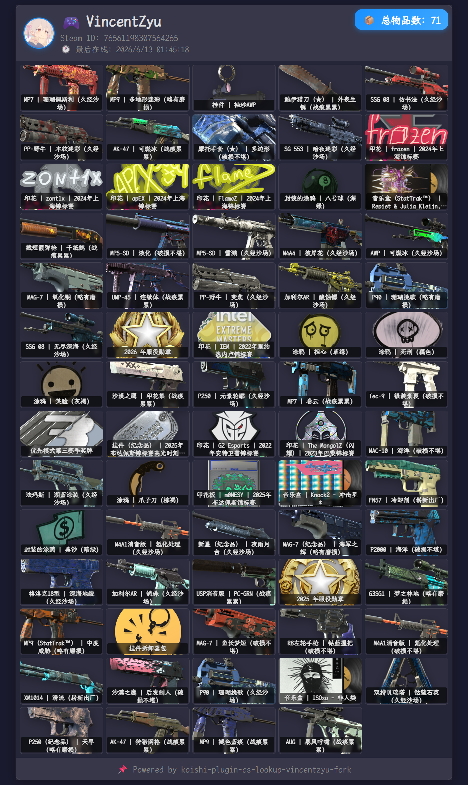

# koishi-plugin-cs-lookup-vincentzyu-fork

[](https://www.npmjs.com/package/koishi-plugin-cs-lookup-vincentzyu-fork)
[](https://www.npmjs.com/package/koishi-plugin-cs-lookup-vincentzyu-fork)

[](https://github.com/VincentZyu233/koishi-plugin-cs-lookup-vincentzyu-fork)
[](https://gitee.com/vincent-zyu/koishi-plugin-cs-lookup-vincentzyu-fork)

[](https://forum.koishi.xyz/t/topic/12558)

基于上游 [`koishi-plugin-cs-lookup`](https://github.com/itzdrli/koishi-plugin-cs-lookup) fork 的增强版插件，用于查询 CS2 / CS:GO Steam 库存并渲染图片，同时补充了 SteamID 绑定、缓存、代理、渲染自定义和 REST API 等能力。

## 📸 效果预览



---

## 📦 依赖

运行前需要确保以下 Koishi 插件已启用：

- 🎭 `puppeteer` — 网页渲染和截图
- 🗄️ `database` — 保存用户绑定关系和库存缓存
- 📊 `umami-statistics-service` — 匿名统计（可通过 `data_collect` 关闭）

---

## 🚀 快速开始

### 1️⃣ 安装

在 Koishi 插件市场中安装 `cs-lookup-vincentzyu-fork`，或以本地插件方式加载当前目录。

### 2️⃣ 配置 Steam API Key

推荐同时配置下面两个 Key：

| Key | 来源 | 费用 | 用途 |
|-----|------|------|------|
| `officialSteamApiKey` | https://steamcommunity.com/dev/apikey | 免费 | 获取玩家信息（大陆网络可能不稳定） |
| `steamWebApiKey` | https://www.steamwebapi.com | 付费 | 获取玩家信息 + **getid 指令必需** |

如果两个 Key 都配置了，插件会按 `preferOfficialSteamApi` 的设置选择主通道，并在失败时自动回退。

### 3️⃣ 可选配置代理

如果服务器访问 Steam 相关接口不稳定，建议在插件配置中启用代理，支持以下协议：

`http` / `https` / `socks4` / `socks5` / `socks5h`

---

## ⚙️ 配置项

### 🛡️ 隐私与统计

| 配置项 | 类型 | 默认值 | 说明 |
|--------|------|--------|------|
| `data_collect` | boolean | `false` | 是否允许通过 umami 发送匿名使用统计 |

### ⚙️ 基础设置

| 配置项 | 类型 | 默认值 | 说明 |
|--------|------|--------|------|
| `enableInvDbCache` | boolean | `false` | cs-inv 是否默认使用数据库缓存库存 JSON（true=有缓存直接用，false=每次实时拉取） |
| `preferOfficialSteamApi` | boolean | `true` | 优先使用 Steam 官方 API（关闭则优先使用 steamwebapi.com） |
| `officialSteamApiKey` | string | `""` | Steam 官方免费 Key，从 https://steamcommunity.com/dev/apikey 获取 |
| `steamWebApiKey` | string | `""` | steamwebapi.com 付费 Key（配额有限），getid 功能依赖此 Key |

### 📨 通用消息设置

| 配置项 | 类型 | 默认值 | 说明 |
|--------|------|--------|------|
| `csInvCommandName` | string | `"cs-inv"` | 🎒 查询库存指令名称 |
| `csBindCommandName` | string | `"cs-bind"` | 🔗 绑定 SteamID 指令名称 |
| `csMyidCommandName` | string | `"cs-myid"` | 🆔 查询已绑定 SteamID 指令名称 |
| `getidCommandName` | string | `"getid"` | 🔍 解析 SteamID 指令名称 |
| `replyToUser` | boolean | `true` | 是否引用回复用户触发的消息 |

### 🎨 渲染设置（puppeteer 网页截图）

| 配置项 | 类型 | 默认值 | 说明 |
|--------|------|--------|------|
| `enableDarkTheme` | boolean | `true` | 🌙 使用深色主题 |
| `enableAvatarBackground` | boolean | `false` | 🖼️ 背景贴上用户头像（磨砂玻璃效果） |
| `enableImageCache` | boolean | `true` | 💾 缓存饰品图片到磁盘（大幅提升重复查询速度） |
| `gridColumns` | number (2-10) | `5` | 📊 库存物品列数 |
| `imageType` | `"png"` / `"jpeg"` / `"webp"` | `"jpeg"` | 📤 渲染图片输出格式（PNG 不支持 quality） |
| `imageQuality` | number (0-100) | `60` | 📏 截图质量（对 PNG 无效） |
| `waitUntil` | `"load"` / `"domcontentloaded"` / `"networkidle0"` / `"networkidle2"` | `"domcontentloaded"` | ⏳ 页面加载等待策略 |
| `showItemCount` | boolean | `true` | 🔢 是否显示饰品总数量 |
| `itemCountCorner` | `"top-left"` / `"top-right"` / `"bottom-left"` / `"bottom-right"` | `"top-right"` | 📍 饰品数量显示角标位置 |
| `itemNamePosition` | `"top"` / `"center"` / `"bottom"` | `"bottom"` | 📝 饰品名称显示位置 |
| `itemNameBgOpacity` | number (0-1, step 0.05) | `0.6` | 🌫️ 饰品名称底纹透明度 |
| `itemImageScale` | number (50-300) | `180` | 🖼️ 饰品图片缩放比例 (%) |
| `customFontPath` | string | `""` | 🔤 自定义字体文件绝对路径（留空使用默认） |
| `footerCustomText` | string | `"📌 Powered by koishi-plugin-cs-lookup-vincentzyu-fork"` | 📝 卡片底部自定义文字 |
| `watermarkEnabled` | boolean | `true` | 💧 是否启用水印 |
| `watermarkText` | string | `"generated by koishi-plugin-cs-lookup-vincentzyu-fork"` | 💧 水印文字内容 |
| `watermarkFontSize` | number (8-72) | `16` | 🔠 水印字体大小 (px) |
| `watermarkAngle` | number (0-360) | `45` | 📐 水印倾斜角度 |
| `watermarkOpacity` | number (0-1, slider) | `0.4` | 👁️ 水印不透明度 |
| `watermarkRowGap` | number (1-200) | `30` | ↕️ 水印行间距 (px) |
| `watermarkColGap` | number (1-300) | `20` | ↔️ 水印列间距 (px) |

### 🔌 代理配置

| 配置项 | 类型 | 默认值 | 说明 |
|--------|------|--------|------|
| `proxy.enabled` | boolean | `true` | ✅ 是否启用代理 |
| `proxy.protocol` | `"http"` / `"https"` / `"socks4"` / `"socks5"` / `"socks5h"` | `"socks5h"` | 🧦 代理协议（socks5h 支持远程 DNS） |
| `proxy.host` | string | `"127.0.0.1"` | 🏠 代理地址 |
| `proxy.port` | number | `7897` | 🛖 代理端口 |
| `useUserAgent` | boolean | `true` | 🌐 是否使用自定义 User-Agent |
| `userAgent` | string | `"Mozilla/5.0 (Windows NT 10.0; Win64; x64) AppleWebKit/537.36 (KHTML, like Gecko) Chrome/139.0.0.0 Safari/537.36"` | 🔍 自定义 UA（Chrome 打开 chrome://version 查看） |
| `useCookie` | boolean | `false` | 🍪 是否使用自定义 Cookie |
| `cookie` | string | `""` | 🍪 自定义 Cookie（F12 Network 找 steamcommunity.com/inventory 请求的 cookie） |

### 🔌 REST API 设置

| 配置项 | 类型 | 默认值 | 说明 |
|--------|------|--------|------|
| `enableRestServer` | boolean | `false` | 🌐 是否启用内置 REST API 服务器 |
| `restServerHost` | string | `"0.0.0.0"` | 🏠 监听地址 |
| `restServerPort` | number | `60730` | 📡 监听端口 |
| `restServerToken` | string | `"请修改token"` | 🔐 访问令牌（部署到公网前必须修改） |
| `restServerSecret` | string | `"请修改secret"` | 🔑 请求头密钥（部署到公网前必须修改） |
| `imageCompressionQuality` | number (0-100) | `80` | 🖼️ REST API 返回图片的压缩质量 |

### 🐛 Debug 设置

| 配置项 | 类型 | 默认值 | 说明 |
|--------|------|--------|------|
| `logLevel` | `"silent"` / `"error"` / `"warn"` / `"info"` / `"debug"` | `"info"` | 🔊 日志级别：debug 输出全部调试信息 |
| `verboseFileLog` | boolean | `false` | 📁 库存完整 JSON 输出到 `../cache/inv_data/res.json` |

---

## 📋 指令

### 🎒 `cs-inv [targetUser]`

查询 CS 库存并返回渲染图片。

**option选项：**

| 选项 | 缩写 | 说明 |
|------|------|------|
| `--steamid` | `-s` | 直接指定 SteamID，不走绑定表 |
| `--refresh` | `-r` | 强制刷新数据库中的库存缓存 |
| `--no-refresh` | `-n` | 强制使用数据库缓存（如有） |

**参数说明：**

- 不带参数 → 查询当前用户已绑定的 SteamID
- 传入 `@用户` 或 `userId` → 查询该用户已绑定的 SteamID
- 使用 `-s <steamid>` → 直接查询指定 SteamID

**示例：**
```
cs-inv
cs-inv @某人
cs-inv 123456789
cs-inv -s 7656119xxxxxxxxxx
cs-inv --refresh
cs-inv --no-refresh
```

### 🔗 `cs-bind <steamId> [userId]`

绑定 SteamID 到 Koishi 用户。

**参数优先级：** 消息里第一个 `@` 用户 > 第二参数 `userId` > 当前发送者

如果已有绑定，插件会要求回复 `ok` 或 `cancel` 确认是否替换。

**示例：**
```
cs-bind 7656119xxxxxxxxxx
cs-bind 7656119xxxxxxxxxx @某人
cs-bind 7656119xxxxxxxxxx 123456789
```

### 🆔 `cs-myid`

查看自己当前绑定的 SteamID。

### 🔍 `getid <Steam个人资料链接>

通过 Steam 主页链接解析 SteamID。该指令依赖 `steamWebApiKey`。

> 💡 **没有 API Key？** 也可以用 [steamid.io](https://steamid.io) 免费查询：  
> 打开 `https://steamid.io` → 粘贴个人资料链接 → 直接获取 SteamID64

**示例：**
```
getid https://steamcommunity.com/id/VincentZyu/
getid https://steamcommunity.com/profiles/76561199321190157/
```

---

## 💾 缓存与数据文件

| 位置 | 用途 |
|------|------|
| 数据库表 `cs_lookup_vincentzyu_fork` | Koishi 用户与 SteamID 的绑定关系 |
| 数据库表 `cs_inv_cache_vincentzyu_fork` | Steam 库存接口返回的 JSON 缓存 |
| `cache/inv_image/` | 饰品图片 Base64 磁盘缓存 |
| `cache/inv_data/res.json` | `verboseFileLog` 开启时输出的完整库存 JSON |

---

## 🔗 上游信息

- 上游仓库：https://github.com/itzdrli/koishi-plugin-cs-lookup
- 本 fork 初始参考版本：`1.0.1`

---

## 📄 License

AGPL-3.0
